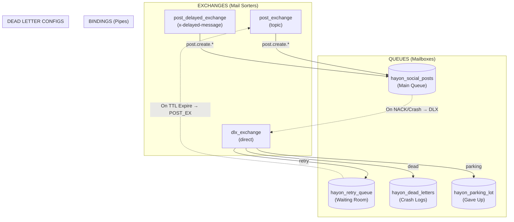
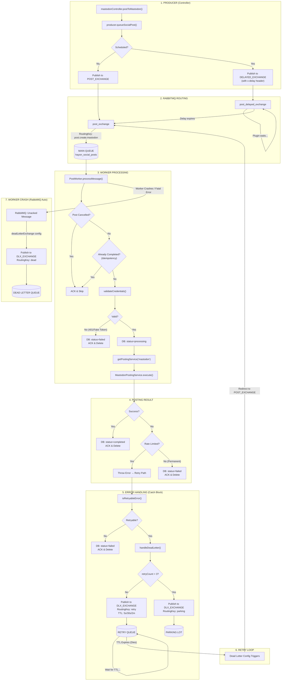

# RabbitMQ Posting Architecture

## Infrastructure Diagram
Shows the exchanges, queues, and bindings set up in [index.ts](file:///home/hafeez/projects/project_hayon/hayon/backend/src/workers/index.ts).

---

## Full Message Flow (All Cases)

---

## Function Reference Table

| Step | File | Function | What it Does |
|:---|:---|:---|:---|
| 1 | [mastodon.controller.ts](file:///home/hafeez/projects/project_hayon/hayon/backend/src/controllers/platforms/mastodon.controller.ts) | [postToMastodon()](file:///home/hafeez/projects/project_hayon/hayon/backend/src/controllers/platforms/mastodon.controller.ts#112-167) | Creates Post in DB, calls producer |
| 2 | [producer.ts](file:///home/hafeez/projects/project_hayon/hayon/backend/src/lib/queues/producer.ts) | [queueSocialPost()](file:///home/hafeez/projects/project_hayon/hayon/backend/src/lib/queues/producer.ts#48-76) | Publishes to exchange |
| 3 | [index.ts](file:///home/hafeez/projects/project_hayon/hayon/backend/src/workers/index.ts) | [startWorker()](file:///home/hafeez/projects/project_hayon/hayon/backend/src/workers/index.ts#7-149) | Sets up all exchanges/queues/bindings |
| 4 | [post.worker.ts](file:///home/hafeez/projects/project_hayon/hayon/backend/src/workers/post.worker.ts) | [processMessage()](file:///home/hafeez/projects/project_hayon/hayon/backend/src/workers/post.worker.ts#68-236) | Main worker logic |
| 5 | [posting/index.ts](file:///home/hafeez/projects/project_hayon/hayon/backend/src/services/posting/index.ts) | [validateCredentials()](file:///home/hafeez/projects/project_hayon/hayon/backend/src/services/posting/index.ts#60-76) | Checks if token is valid |
| 6 | [posting/index.ts](file:///home/hafeez/projects/project_hayon/hayon/backend/src/services/posting/index.ts) | [getPostingService()](file:///home/hafeez/projects/project_hayon/hayon/backend/src/services/posting/index.ts#20-27) | Factory for platform service |
| 7 | [mastodon.posting.service.ts](file:///home/hafeez/projects/project_hayon/hayon/backend/src/services/posting/mastodon.posting.service.ts) | [execute()](file:///home/hafeez/projects/project_hayon/hayon/backend/src/services/posting/base.posting.service.ts#70-99) | Calls Mastodon API |
| 8 | [post.worker.ts](file:///home/hafeez/projects/project_hayon/hayon/backend/src/workers/post.worker.ts) | [isRetryableError()](file:///home/hafeez/projects/project_hayon/hayon/backend/src/workers/post.worker.ts#48-66) | Decides retry vs permanent |
| 9 | [dlx.setup.ts](file:///home/hafeez/projects/project_hayon/hayon/backend/src/lib/queues/dlx.setup.ts) | [handleDeadLetter()](file:///home/hafeez/projects/project_hayon/hayon/backend/src/lib/queues/dlx.setup.ts#57-100) | Sends to retry/parking |

---

## Routing Key Legend

| Key | Source | Destination | Meaning |
|:---|:---|:---|:---|
| `post.create.mastodon` | Producer | Main Queue | New post for Mastodon |
| [retry](file:///home/hafeez/projects/project_hayon/hayon/backend/src/controllers/post.controller.ts#74-85) | Worker | Retry Queue | Network error, try later |
| `dead` | RabbitMQ | Dead Letter Queue | Worker crashed |
| `parking` | Worker | Parking Lot | Max retries reached |
